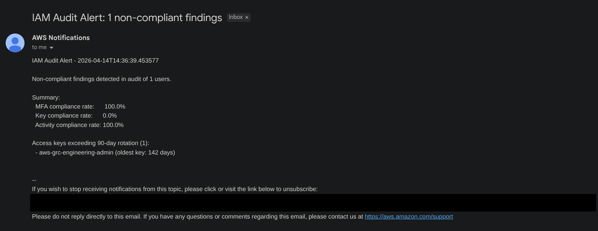

# IAM Audit

A Python tool that audits all IAM users in your AWS account for MFA compliance.

## Overview

This script checks each IAM user to determine:
1. **Console Access** — Does the user have a password to log into AWS Console?
2. **MFA Status** — If they have console access, is MFA enabled?

## Requirements

- Python 3.x
- `boto3` library
- AWS CLI configured with credentials (`aws configure`)

### Install dependencies
```bash
pip install boto3
```

## Usage

```bash
python iam_audit.py
```

**Sample output:**
```
Checking: admin-user
    [PASS] MFA enabled for console user.
Checking: developer
    [FAIL] Console access WITHOUT MFA!
Checking: lambda-role-user
    [INFO] No console access (MFA not required).

========================================
Total users: 3
Compliant (MFA enabled): 1
No console access: 1
Non-compliant: 1

Audit started: 2026-01-02T14:30:00.123456
Audit completed: 2026-01-02T14:30:02.456789
Elapsed time: 2.33 seconds
Compliance rate: 33.3%

Results exported to:
  - iam_audit_2026-01-02T14-30-00.csv
  - iam_audit_2026-01-02T14-30-00.json
```

## Output Legend

| Status | Meaning |
|--------|---------|
| `[PASS]` | Console user with MFA enabled |
| `[FAIL]` | Console user WITHOUT MFA |
| `[INFO]` | No console access (programmatic only) ℹ|

## Export Formats

The tool automatically exports audit results in two formats for compliance reporting:

### CSV Export (`iam_audit_YYYY-MM-DDTHH-MM-SS.csv`)
- Opens directly in Excel or Google Sheets
- Ideal for auditor review and compliance officers
- Contains: username, console access status, MFA status, compliance result

**Example CSV:**
```csv
username,has_console_access,mfa_enabled,compliance_status
admin-user,True,True,PASS
developer,True,False,FAIL
lambda-role-user,False,False,INFO
```

### JSON Export (`iam_audit_YYYY-MM-DDTHH-MM-SS.json`)
- Machine-readable format for automation and tool integration
- Includes audit metadata (timestamps, compliance rate, user counts)
- Ideal for SIEM integration and security dashboards

**Example JSON:**
```json
{
    "metadata": {
        "audit_start": "2026-01-02T14:30:00.123456",
        "audit_end": "2026-01-02T14:30:02.456789",
        "elapsed_seconds": 2.33,
        "total_users": 3,
        "compliance_rate": "33.3%"
    },
    "findings": [
        {
            "username": "admin-user",
            "has_console_access": true,
            "mfa_enabled": true,
            "compliance_status": "PASS"
        }
    ]
}
```

## Alerting

When the `IAM_AUDIT_SNS_TOPIC_ARN` environment variable is set, the audit publishes a summary of non-compliant findings to the given SNS topic at the end of each run. Maps to NIST 800-53 **SI-4(5)** (System-Generated Alerts).

Alerts cover all three compliance dimensions (MFA, access key rotation, user inactivity) in a single summary message per audit run. No alert is published when the environment variable is unset or when zero findings exist.

### Setup

Create an SNS topic, subscribe your email, and export the ARN before running the audit:

```bash
# 1. Create the SNS topic (one-time)
aws sns create-topic --name iam-audit-alerts --region <your-region>

# 2. Subscribe your email (one-time; confirm the link AWS sends you)
aws sns subscribe \
  --topic-arn arn:aws:sns:<your-region>:<your-account>:iam-audit-alerts \
  --protocol email \
  --notification-endpoint you@example.com \
  --region <your-region>

# 3. Export the ARN (add to ~/.bashrc or ~/.zshrc for persistence)
export IAM_AUDIT_SNS_TOPIC_ARN="arn:aws:sns:<your-region>:<your-account>:iam-audit-alerts"

# 4. Run the audit
python iam_audit.py
```

### Behavior

| Condition | Result |
|-----------|--------|
| `IAM_AUDIT_SNS_TOPIC_ARN` unset | Alerting skipped; audit completes normally |
| Topic ARN set, zero findings | Alerting skipped; no noise email |
| Topic ARN set, findings exist | Summary email published with MessageId logged |
| Topic ARN invalid or SNS error | `[WARN]` logged; audit still completes with exit 0 |

### Sample Alert

```
Subject: IAM Audit Alert: 2 non-compliant findings

IAM Audit Alert - 2026-04-14T14:36:38

Non-compliant findings detected in audit of 5 users.

Summary:
  MFA compliance rate:      80.0%
  Key compliance rate:      75.0%
  Activity compliance rate: 100.0%

Console access WITHOUT MFA (1):
  - developer

Access keys exceeding 90-day rotation (1):
  - service-account (oldest key: 142 days)
```

**Verified delivery** (sensitive values redacted):



The IAM identity running the script needs `sns:Publish` on the topic.

## Key Concepts Learned

### AWS IAM API
| Concept | Description |
|---------|-------------|
| `iam.list_users()` | Get all IAM users |
| `iam.list_mfa_devices()` | Check MFA status |
| `iam.get_login_profile()` | Check console access |
| Exception handling | API throws error when config doesn't exist |

### Python Features
| Concept | Description |
|---------|-------------|
| `datetime` module | Timestamp tracking and ISO 8601 formatting |
| `csv.DictWriter` | Writing structured data to CSV files |
| `json.dump()` | Exporting Python objects to JSON format |
| List of dictionaries | Structured data collection for export |
| Context managers | Safe file handling with `with open()` |
| Functions & docstrings | Code organization and documentation |

## GRC Application

This tool targets the **NIST 800-53 Rev 5**, **FedRAMP High**, and **CJIS Security Policy v6.0** catalogs — the primary frameworks for U.S. public sector cloud workloads. CJIS v6.0 adopts NIST 800-53 Rev 5 directly as of April 1, 2026, so control identifiers match across all three columns; the CJIS column notes the Policy Area for assessor cross-reference.

### Control Mapping

| Audit Check | NIST 800-53 Rev 5 | FedRAMP High | CJIS v6.0 |
|-------------|-------------------|--------------|-----------|
| Root account MFA + hardware token detection | IA-2(1), IA-2(6) | IA-2(1), IA-2(6) | IA-2(1), IA-2(6) — Policy Area 6 |
| IAM user MFA (console access) | IA-2(1), IA-2(2) | IA-2(1), IA-2(2) | IA-2(1), IA-2(2) — Policy Area 6 |
| Access key rotation (90-day) | IA-5(1), AC-2(1) | IA-5(1), AC-2(1) | IA-5(1), AC-2(1) — Policy Areas 5, 6 |
| User inactivity detection | AC-2(3), AC-2(12) | AC-2(3), AC-2(12) | AC-2(3) — Policy Area 5 |
| Password policy compliance | IA-5(1) | IA-5(1) | IA-5(1) — Policy Area 6 |
| SNS alerting for non-compliant findings | SI-4(5), AU-6(1) | SI-4(5), AU-6(1) | SI-4(5) — Policy Area 12 |
| CSV/JSON timestamped evidence export | AU-12, AU-6, CA-7 | AU-12, AU-6, CA-7 | AU-12, AU-6 — Policy Area 4 |

### Audit Relevance

**Root account MFA verification** — Produces direct evidence for the IA-2(1) assessment objective (MFA to privileged accounts). Hardware-token detection satisfies IA-2(6) where a separate physical device is required. Evidence fields: `root_mfa_enabled`, `root_mfa_type` in the CSV/JSON output.

**IAM user MFA audit** — Records where `has_console_access=true` + `mfa_enabled=false` are direct IA-2(1)/(2) control failures. Assessors can filter the CSV output for these rows as deficiency findings without re-running the audit.

**Access key rotation** — Flags keys older than 90 days against IA-5(1) authenticator lifetime parameters. Combined with AC-2(1) automated account management, this demonstrates continuous detection of stale credentials rather than a point-in-time snapshot.

**User inactivity detection** — Credentials unused beyond the configured window are the canonical "atypical usage" pattern under AC-2(12), which requires monitoring accounts for atypical usage and reporting it to defined personnel. The tool's per-user `days_since_activity` field also supports the AC-2(3) inactive-account parameter; FedRAMP High sets AC-2(3) at 35 days for non-user accounts, and auditors can re-filter the same output to that stricter threshold without re-running the audit.

**Password policy compliance** — Reads the account password policy and maps each setting (minimum length, complexity, reuse prevention, max age) to the IA-5(1) assessment objectives. A missing policy is documented as a finding rather than silently skipped.

**SNS alerting** — Maps directly to SI-4(5), which requires alerting designated personnel when system-generated indications of compromise occur. The audit's non-compliant findings (missing MFA, stale access keys, inactive users) are exactly that class of system-generated alert. Automating the review-to-alert path also supports AU-6(1) (automated integration of audit record review, analysis, and reporting), closing the loop from audit run to operator notification without manual handoff.

**Timestamped evidence output** — CSV/JSON files with ISO 8601 filenames (`iam_audit_YYYY-MM-DDTHH-MM-SS.{csv,json}`) provide the audit records (AU-12) and the structured review surface (AU-6). Paired with a scheduled run cadence, the same outputs feed CA-7 continuous monitoring.

### FedRAMP 20x Alignment

FedRAMP 20x shifts evidence collection from point-in-time documents to continuous, machine-readable signals — Key Security Indicators (KSIs). This tool is positioned as a KSI evidence producer for IAM:

- **Privileged access MFA** — root + IAM user MFA state rolled up to a single compliance rate per audit run.
- **Authenticator lifetime** — percentage of access keys under the 90-day rotation threshold.
- **Account hygiene** — count of users with credentials unused beyond the inactivity window.

The JSON output is the stable machine interface; downstream consumers (`evidence-logger`, OSCAL assemblers) can ingest findings without parsing console text. The `metadata` block (audit timestamps, `total_users`, `compliance_rate`) maps directly to OSCAL Assessment Results observation records.

## Future Enhancements

- Access review workflow module — certification and approval workflows for quarterly user access reviews (AC-2(1), AC-2(3))

## Framework Reference

Control family mappings and AWS implementation details are documented in [nist-800-53-rev-5-to-aws-mapping](https://github.com/relevantGRC/grc-suite/tree/main/AWS/nist-800-53-rev-5-to-aws-mapping%20)
