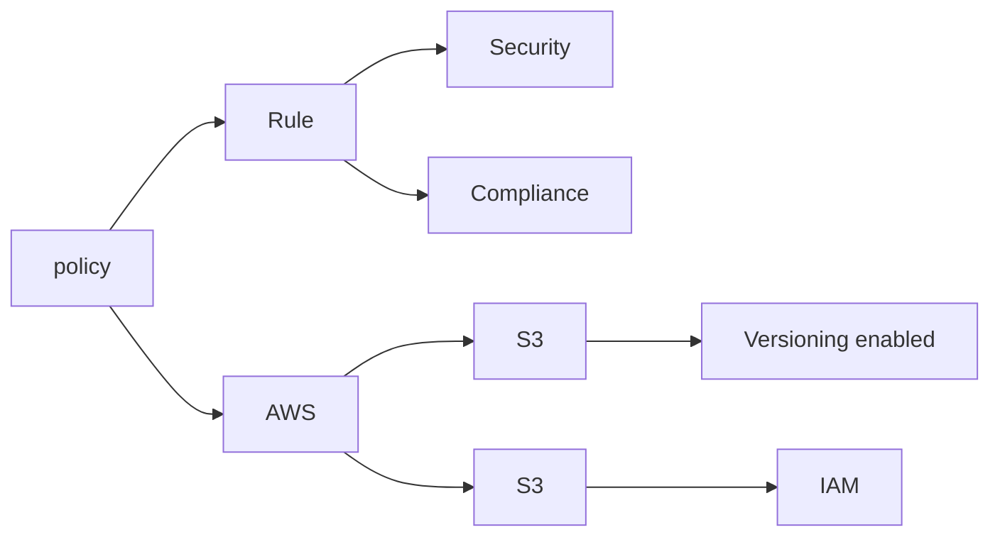

## What is Policy-as-code (PaC)
Policy as Code is a rule that expresses your security, compliance, or operational policies into a machine-readable format (like YAML, Rego, JSON) and are stored in version control, evaluated automatically within pipelinesor platforms.

## Illustration



## Repository Structure
This repository currently includes:

```
/policy-as-code
  ├── README.md
  ├── policies/
  │   ├── iam.rego
  │   ├── s3.rego
  ├── tests/
  │   └── iam_test.rego
  ├── .github/
  │   └── workflows/
  │       └── policy-check.yml
```
## Choosing a Policy Engine

|Tool	| Language |	Use Cases |
|-----|----------|-----------|
|Open Policy Agent (OPA)|	Rego	|Kubernetes, Terraform, APIs|
|HashiCorp| Sentinel	|Sentinel	Terraform, Vault|
|Conftest|	Rego|	YAML, Kubernetes, Docker|
|TFLint / Checkov|	HCL / Python|	Terraform|
|Kubernetes Admission Controllers|	YAML/Rego/Webhooks|	Kubernetes policies|

